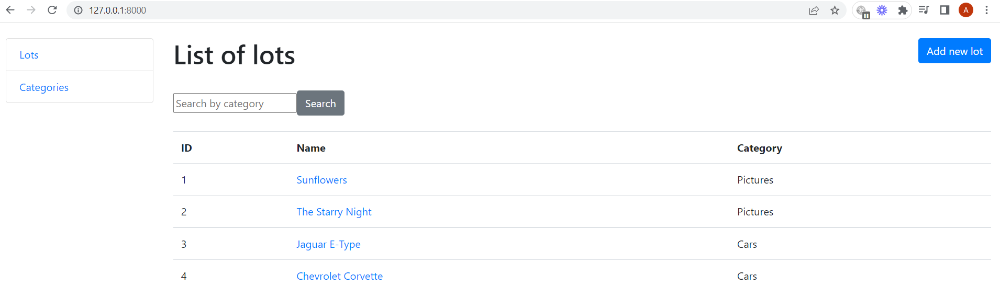
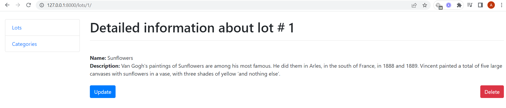
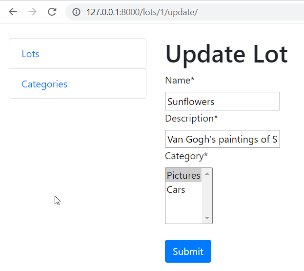
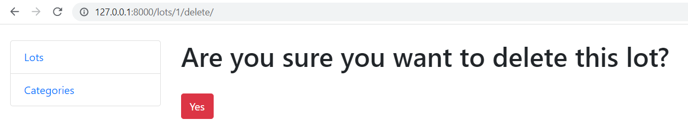
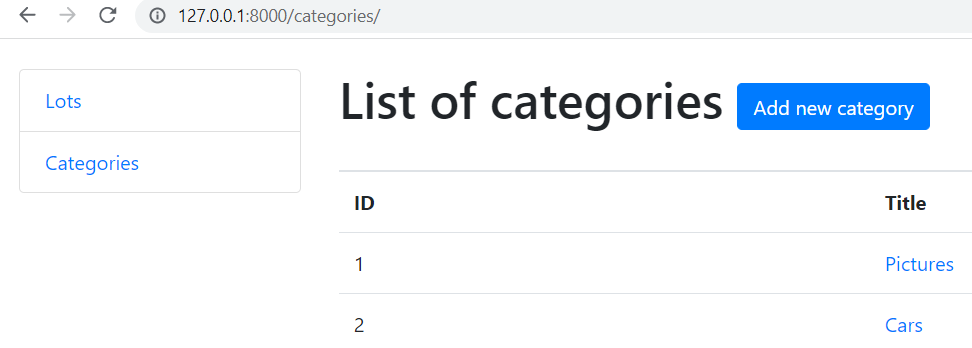

# AuctionDjango

Test task for Backend Developer

## Installation

Python3 must be installed

```shell
git clone https://github.com/LaskoA/AuctionDjango
cd AuctionDjango

Virtual environment install for Windows:
  - python3 -m venv venv
  - source venv/bin/activate
  - pip install -r requirements.txt
  
Virtual environment install for Mac:
  - sudo pip install virtualenv
  - virtualenv env
  - source env/bin/activate
  
python manage.py runserver
python manage.py makemigrations
python manage.py migrate
```

## Features

- list of Lots and Categories
- ability to add, modify and delete Lots and Categories
- possibility to vied detailed information about each Lot and Category
- possibility to filter Lots according to title of Category


## Demo





